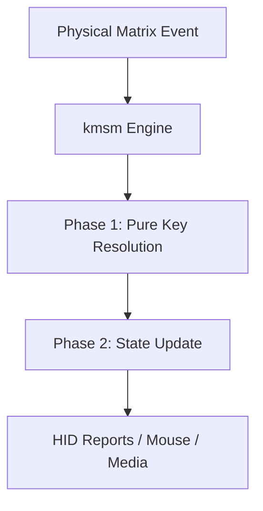

`kmsm` (Key Mapping State Machine) is the central keyboard event processing engine of **rktk**. It is a platform-agnostic, `embassy`-free, and `async`-free state machine that receives physical matrix changes and translates them into logical keyboard reports (HID Keyboard, Mouse, and Media).

---

## Architecture Overview

At its core, `kmsm` decouples hardware-level key scans from application-level output behaviors. It models the keyboard layout as a multi-dimensional keymap and evaluates state transitions based on scan ticks and time delta.



### Main Responsibilities
1. **Event Coordination**: Translating raw matrix switch events (`(row, col, pressed)`) into high-level key codes.
2. **Behavior Resolution**: Running distinct state machine sub-resolvers for normal keys, tap-holds, tap-dance, oneshot modifiers, and combos.
3. **Layer Management**: Dynamically tracking active layers and resolving layer inheritance on key press and release.
4. **HID Output Generation**: Processing mouse movements, scroll-wheel scaling, and aggregating keycode lists for the USB/BLE reports.

---

## The Key Processing Pipeline

Processing within the `kmsm` engine is strictly split into two sequential phases to guarantee deterministic state transitions and eliminate order-dependent evaluation bugs.

### Phase 1: Pure Key Resolution (Pure Evaluation)

This phase operates on a side-effect-free basis. It resolves the exact keycodes affected by physical key changes, time transitions, and active layer statuses.

During this phase, any layer-switching action (such as a momentary layer activation) is kept inside a temporary active layer tracking buffer (`temp_layers`). This ensures that keys pressed simultaneously in the same scan tick inherit and lookup keycodes on the newly updated layers correctly, without bleeding incomplete mutations into persistent keyboard state.

The resolution phase consists of three stages executed in `KeyResolver::resolve_key`:

1. **Pre-Resolve**: Evaluates time thresholds and combo keys (multi-key chords) before direct key-action mapping.
2. **Direct Processing**: Resolves the action on the matrix coordinate using layer-inheritance lookup, routing the event to the appropriate state sub-resolver (Normal, Tap-Hold, Tap-Dance, etc.).
3. **Post-Resolve**: Handles time-ticked completions (such as tap-dance repeats and oneshot timeouts) and finalizes the output queue.

Instead of opaque and costly closure chains (`FnMut`), all resolved actions append to a concrete event list:
```rust
heapless::Vec<(KeyCode, EventType), 16>
```

### Phase 2: State Update (State Mutations)

Once key resolution is complete, the resulting event list is processed sequentially to mutate the active keyboard state. This phase handles:
- Updating persistent active layer flags.
- Triggering mouse movements and mouse click releases.
- Accumulating keys, modifiers, and media actions into the current HID report buffer.

---

## State Resolvers & Engines

### 1. Normal Key Engine (`NormalState`)
Handles standard key press and release mappings.

#### Coordinates RAM Optimization (3-Byte Design)
In embedded environments, RAM optimization is critical. `kmsm` uses a highly optimized active key tracking system.
Instead of storing full keycodes per active key in RAM (which consumed 8 bytes per slot due to optional second keycodes), `kmsm` stores only the physical coordinate and the layer on which it was pressed:

```rust
struct ActiveKey {
    row: u8,
    col: u8,
    pressed_layer: u8,
}
```

This reduces the RAM footprint to just **3 bytes per pressed key** (a **~62% reduction**). It also supports infinite simultaneous keycodes (macros, chords, multiple characters mapped to the same key switch position) with zero additional RAM overhead.

#### Safe Dynamic Release Lookups
Because the physical switch only registers a release at a coordinate `(row, col)`, the engine dynamically retrieves the keycode from flash memory (ROM) at the moment of release using the stored `pressed_layer`.
This lookup is safe against layer changes and live keymap remapping:
- **Layer Immunity**: If you switch layers while holding a key, releasing it still dynamically resolves using the layer on which the key was originally pressed.
- **Remapping Safety**: If you live-remap the keymap via the GUI remap tool while holding a key, releasing it will resolve the *newly mapped* keycode, guaranteeing clean and safe release actions to the host OS.

### 2. Tap-Hold Engine (`TapHoldState`)
Resolves keys that perform different actions depending on whether they are tapped (pressed and released quickly) or held down.
- **Tapping**: Sends a standard keycode (e.g., `Space` or `Enter`).
- **Holding**: Activates a modifier or layer (e.g., `Shift` or `Layer 2`).

### 3. Tap-Dance Engine (`TapDanceState`)
Tracks rapid, consecutive taps on the same key within a time threshold, allowing a single switch to execute up to 4 different actions (e.g., single-tap for `A`, double-tap for `B`, triple-tap for layer toggle).

### 4. Oneshot Modifier Engine (`OneshotState`)
Manages sticky modifiers or layers. Pressing a oneshot key keeps that modifier active only for the *next* pressed normal key, then automatically deactivates it.

### 5. Combo Engine (`ComboState`)
Monitors simultaneous presses of two or more keys (chords). When keys defined in a combo are pressed together within a brief time window (e.g. 20ms), they are intercepted and replaced with a custom target action.

---

## Data Flow Example: Key Press & Release

The diagram below shows how an input matrix event travels through `kmsm` to form a USB HID Report.

```text
[Matrix Event: Press (0, 0)]
            │
            ▼
┌──────────────────────────────┐
│  Phase 1: KeyResolver        │
│  - Looks up Layer 0, (0, 0)  │
│  - Resolves normal key: Key A│
└───────────┬──────────────────┘
            │ Emits: KeyCode::Key(Key::A), EventType::Press
            ▼
┌──────────────────────────────┐
│  Phase 2: State Updater      │
│  - Adds Key A to report      │
│  - Mutates report state      │
└───────────┬──────────────────┘
            │
            ▼
[USB HID Report: Keyboard [Key A, 0, 0, 0, 0, 0]]
```
