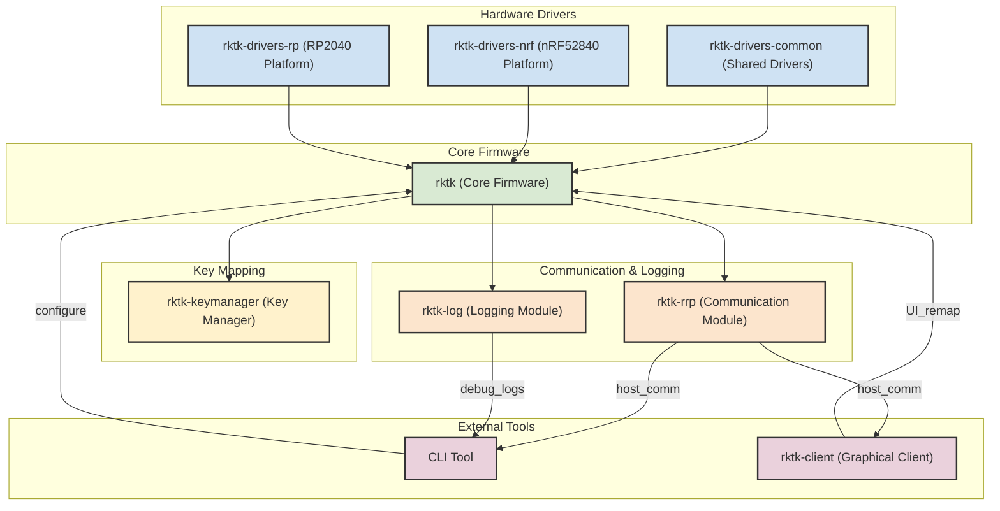

This page shows rktk's related crates and their relationships

```mermaid
flowchart TD
    subgraph "Hardware Drivers"
        Common["rktk-drivers-common (Shared Drivers)"]
        nRF["rktk-drivers-nrf (nRF52840 Platform)"]
        RP["rktk-drivers-rp (RP2040 Platform)"]
    end

    subgraph "Core Firmware"
        CF["rktk (Core Firmware)"]
    end

    subgraph "Key Mapping"
        KM["rktk-keymanager (Key Manager)"]
    end

    subgraph "Communication & Logging"
        RRP["rktk-rrp (Communication Module)"]
        LOG["rktk-log (Logging Module)"]
    end

    subgraph "External Tools"
        CLI["CLI Tool"]
        Client["rktk-client (Graphical Client)"]
    end

    %% Connections from Hardware Drivers to Core Firmware
    Common --> CF
    nRF    --> CF
    RP     --> CF

    %% Core Firmware to Key Mapping and Communication/Logging
    CF --> KM
    CF --> RRP
    CF --> LOG

    %% Communication modules interacting with External Tools
    RRP -->|"host_comm"| CLI
    RRP -->|"host_comm"| Client
    LOG -->|"debug_logs"| CLI

    %% External Tools also interact with Core Firmware for configuration and remapping
    CLI -->|"configure"| CF
    Client -->|"UI_remap"| CF

    %% Styles and Colors
    classDef drivers fill:#cfe2f3,stroke:#333,stroke-width:2px;
    classDef core fill:#d9ead3,stroke:#333,stroke-width:2px;
    classDef key fill:#fff2cc,stroke:#333,stroke-width:2px;
    classDef comm fill:#fce5cd,stroke:#333,stroke-width:2px;
    classDef external fill:#ead1dc,stroke:#333,stroke-width:2px;

    class Common,nRF,RP drivers;
    class CF core;
    class KM key;
    class RRP,LOG comm;
    class CLI,Client external;

    %% Click Events
    click CF "https://github.com/nazo6/rktk/tree/master/lib/rktk"
    click Common "https://github.com/nazo6/rktk/tree/master/lib/rktk-drivers-common"
    click nRF "https://github.com/nazo6/rktk/tree/master/lib/rktk-drivers-nrf"
    click RP "https://github.com/nazo6/rktk/tree/master/lib/rktk-drivers-rp"
    click KM "https://github.com/nazo6/rktk/tree/master/lib/rktk-keymanager"
    click RRP "https://github.com/nazo6/rktk/tree/master/lib/rktk-rrp"
    click LOG "https://github.com/nazo6/rktk/tree/master/lib/rktk-log"
    click CLI "https://github.com/nazo6/rktk/tree/master/tools/cli"
    click Client "https://github.com/nazo6/rktk/tree/master/tools/rktk-client"
```
